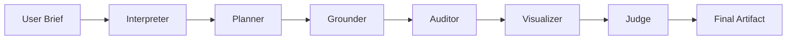

# 🧘 ZenKnowledgeForge

**Local-first deliberative multi-agent LLM system for knowledge synthesis**

Transform vague ideas into structured, actionable knowledge artifacts using a council of specialized AI agents running entirely on your hardware.

[](https://www.python.org/downloads/)
[](https://opensource.org/licenses/MIT)
[-green.svg)](docs/USER_GUIDE.md)

---

## 🌟 What is ZenKnowledgeForge?

ZenKnowledgeForge is a **deliberative multi-agent system** that combines the power of multiple Large Language Models (LLMs) to produce high-quality knowledge artifacts. Unlike traditional single-model approaches, our system uses **six specialized agents** that deliberate, debate, and synthesize information to create:

- 📚 **Research Reports** with citations and evidence
- 🏗️ **Project Specifications** with architecture and phases  
- 📖 **Learning Paths** with progressive complexity

**Key Features:**
- ✅ **100% Local** - No cloud APIs, complete privacy
- ✅ **Multi-Agent Deliberation** - Six specialized LLMs working together
- ✅ **Consumer Hardware** - Runs on RTX 3050 (6GB VRAM) + 16GB RAM
- ✅ **Sequential Execution** - Smart model swapping for VRAM constraints
- ✅ **Rich CLI** - Beautiful terminal UI with progress indicators

---

## 🏛️ The Council of Agents

| Agent | Model | Role | VRAM |
|-------|-------|------|------|
| **Interpreter** | Llama 3.1 8B | Parse brief, extract intent | 5.0 GB |
| **Planner** | Mistral Nemo 12B | Decompose into research questions | 7.5 GB |
| **Grounder** | Qwen 2.5 7B | Retrieve evidence, cite sources | 4.5 GB |
| **Auditor** | Gemma 2 9B | Risk analysis, security assessment | 5.5 GB |
| **Visualizer** | Phi-3.5 Mini | Generate charts/diagrams | 2.5 GB |
| **Judge** | Qwen 2.5 14B | Synthesize, resolve conflicts | 9.0 GB |

Each agent loads sequentially, thinks, then unloads to make room for the next.

---

## 🚀 Quick Start

### Prerequisites
- NVIDIA GPU with 6GB+ VRAM (RTX 3050 or better)
- 16GB+ RAM
- Docker & Docker Compose
- Python 3.10+

### Installation

```bash
# 1. Clone the repository
git clone https://github.com/Niruuu2005/ZenKnowledgeForge.git
cd ZenKnowledgeForge

# 2. Set up Python environment
python -m venv venv
source venv/bin/activate  # Windows: venv\Scripts\activate
pip install -e .

# 3. Configure environment
cp .env.example .env

# 4. Start services (Ollama, Neo4j)
docker-compose up -d

# 5. Download models (~35GB)
bash scripts/pull_models.sh

# 6. Run your first query!
python -m zen "Explain how neural networks learn"
```

---

## 💡 Usage Examples

### Research Mode
Generate comprehensive research reports:

```bash
python -m zen "How do blockchain consensus mechanisms work?" --mode research
```

**Output:** Research report with citations, evidence quality scores, and synthesis.

### Project Mode
Create detailed project specifications:

```bash
python -m zen "Build a real-time chat app with WebSocket" --mode project
```

**Output:** Architecture, components, phases, risk assessment, tech recommendations.

### Learn Mode
Generate personalized learning paths:

```bash
python -m zen "Learn Rust programming from scratch" --mode learn
```

**Output:** Progressive modules with concepts, examples, exercises, and resources.

### Interactive Mode
Answer clarifying questions for better results:

```bash
python -m zen --interactive --mode research
```

### Single Model Mode (⚡ 2-3x Faster)
Use one model for all agents instead of swapping:

```bash
python run_zen.py "Your query" --mode research --single-model
```

**Benefits:**
- Execution time: **8-12 minutes** (vs 15-25 with swapping)
- No model loading delays
- Same model stays loaded throughout

You'll be prompted to choose from available models. See [`SINGLE_MODEL_MODE.md`](SINGLE_MODEL_MODE.md) for details.

---

## 📊 How It Works



1. **Interpreter** analyzes your brief and asks clarifying questions
2. **Planner** breaks it down into research questions and phases
3. **Grounder** retrieves evidence and cites sources
4. **Auditor** assesses risks, dependencies, and feasibility
5. **Visualizer** creates chart and diagram specifications
6. **Judge** synthesizes everything and produces the final artifact

**Consensus Scoring:** The Judge evaluates:
- **Groundedness** (0-1): How well supported by evidence
- **Coherence** (0-1): Logical consistency
- **Completeness** (0-1): Coverage of the topic

If overall score < 0.85, another deliberation round may occur (max 7 rounds).

---

## 🎯 Example Output

```markdown
# Research Report: Blockchain Consensus Mechanisms

> Generated by ZenKnowledgeForge  
> Consensus Score: 0.88

## Executive Summary
Blockchain consensus mechanisms enable distributed networks to agree on a 
single truth without central authority...

## 1. Fundamentals of Consensus
[Detailed analysis with citations]

## 2. Proof of Work (PoW)
[In-depth explanation with evidence]

## Quality Metrics
| Metric | Score |
|--------|-------|
| Groundedness | 0.92 |
| Coherence | 0.88 |
| Completeness | 0.85 |

## References
[1] Nakamoto, S. (2008). Bitcoin: A Peer-to-Peer Electronic Cash System...
```

---

## 📖 Documentation

- **[User Guide](docs/USER_GUIDE.md)** - Installation, usage, troubleshooting
- **[Development Plan](docs/DEVELOPMENT_PLAN.md)** - Roadmap and milestones
- **[Module Specifications](docs/MODULE_SPECIFICATIONS.md)** - Technical details (coming soon)

---

## 🛠️ Architecture

```
ZenKnowledgeForge/
├── config/                  # Agent and hardware configurations
│   ├── agents.yaml         # Model definitions and roles
│   ├── hardware.yaml       # VRAM limits and constraints
│   ├── prompts/            # Agent prompt templates
│   └── templates/          # Jinja2 output templates
├── src/
│   ├── orchestration/      # Core engine and model manager
│   ├── agents/             # Six specialized agents
│   ├── memory/             # Vector store and knowledge graph
│   ├── tools/              # Browser, search, visualization
│   ├── cli/                # CLI and Rich UI
│   └── renderers/          # Markdown, LaTeX, BibTeX
├── tests/                  # Unit and integration tests
└── docs/                   # Documentation
```

---

## 🔬 Technical Details

### Hardware Constraints
- **VRAM Limit:** 6GB (RTX 3050)
- **Max Concurrent Models:** 1 (sequential execution only)
- **OLLAMA_KEEP_ALIVE:** 0 (enforced globally)
- **Model Swap Timeout:** 30 seconds

### Key Technologies
- **Ollama** - LLM inference engine
- **Rich** - Terminal UI
- **Pydantic** - Configuration validation
- **Jinja2** - Template rendering
- **httpx** - Async HTTP client
- **Docker** - Service containerization

### Model Quantization
All models use **q4_K_M** quantization to fit within VRAM:
- Llama 3.1 8B: ~5.0 GB
- Mistral Nemo 12B: ~7.5 GB (RAM spill)
- Qwen 2.5 14B: ~9.0 GB (RAM spill)

---

## 📈 Roadmap

### v0.1.0 (Current - MVP) ✅
- Core orchestration
- All six agents
- CLI with Rich UI
- Basic markdown output

### v0.2.0 (Next)
- ChromaDB vector store
- Session persistence
- Improved error handling

### v0.3.0
- Real web research (Playwright)
- Browser automation
- Actual RAG implementation

### v1.0.0
- Neo4j knowledge graph
- Cross-session learning
- Visual content generation
- Production-ready

---

## 🤝 Contributing

Contributions are welcome! See [DEVELOPMENT_PLAN.md](docs/DEVELOPMENT_PLAN.md) for:
- Current status and roadmap
- How to contribute
- Code standards
- Testing requirements

---

## ⚠️ Current Limitations (v0.1.0)

- **No web search:** Grounder uses placeholder content (next version)
- **No RAG:** Vector store integration pending
- **No knowledge graph:** Neo4j not yet utilized
- **Sequential only:** Hardware constraint (by design)

---

## 📝 License

MIT License - See [LICENSE](LICENSE) file

---

## 🙏 Acknowledgments

Built with love for the local-first AI community. Inspired by multi-agent systems research and the need for privacy-preserving knowledge tools.

**Hardware tested on:** NVIDIA RTX 3050 (6GB VRAM) + 16GB RAM

---

## 📞 Support

- **Issues:** [GitHub Issues](https://github.com/Niruuu2005/ZenKnowledgeForge/issues)
- **Discussions:** [GitHub Discussions](https://github.com/Niruuu2005/ZenKnowledgeForge/discussions)
- **Logs:** Check `./logs/` for debugging

---

**Made with 🧘 by the ZenKnowledgeForge team**
